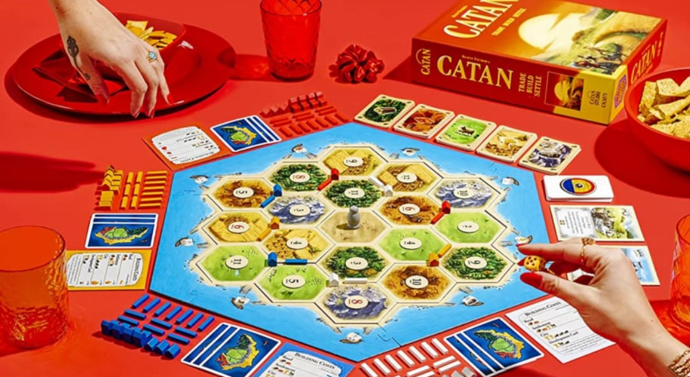
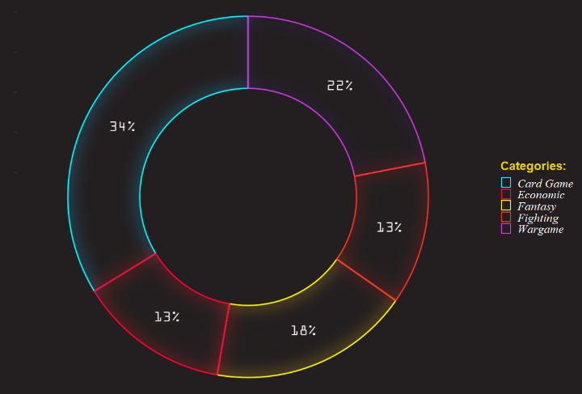
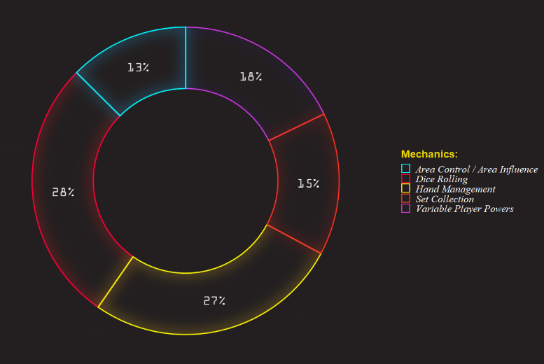

<style type="text/css">
body{ /* Normal  */
      font-size: 14px;
      color: #F2F2F2;
      font-family: Segoe UI;}
td {  /* Table  */
  font-size: 12px;
  color: #Black;}
h1.title {
  font-size: 34px;
  color: #EF3524;
  font-family: Impact;
  font-style: italic}
h1 { /* Header 1 */
  font-size: 24px;
  color: #B70302;
  font-family: Arial Black;}
h2 { /* Header 2 */
  font-size: 20px;
  color: #ECD203;
  font-family: Arial Black;
  font-style: italic;}
h3 { /* Header 3 */
  font-size: 16px;
  color: ##721C54;
  font-family: Arial Black;}
code.r{ /* Code block */
    font-size: 12px;}
pre { /* Code block - determines code spacing between lines */
    font-size: 12px;
    color: #CAB0B9;}
</style>
<style>
body {
text-align: justify}
</style>
<style>
    body { background-color: #231F20; }
    pre, pre:not([class]) { background-color: #231F20;
                            border: #231F20;
                            font-weight: bold}
</style>
<style>
p.caption {
  font-size: 0.9em;
  font-style: italic;
  color: grey;
  margin-right: 10%;
  margin-left: 30%;  
  text-align: justify;
}
</style>
<style>
body {
text-align: justify
}
</style>
<a href="https://github.com/RanggaGemilang" class="github-corner" aria-label="View source on GitHub"><svg width="80" height="80" viewBox="0 0 250 250" style="fill:#fff; color:#151513; position: absolute; top: 0; border: 0; right: 0;" aria-hidden="true"><path d="M0,0 L115,115 L130,115 L142,142 L250,250 L250,0 Z"></path><path d="M128.3,109.0 C113.8,99.7 119.0,89.6 119.0,89.6 C122.0,82.7 120.5,78.6 120.5,78.6 C119.2,72.0 123.4,76.3 123.4,76.3 C127.3,80.9 125.5,87.3 125.5,87.3 C122.9,97.6 130.6,101.9 134.4,103.2" fill="currentColor" style="transform-origin: 130px 106px;" class="octo-arm"></path><path d="M115.0,115.0 C114.9,115.1 118.7,116.5 119.8,115.4 L133.7,101.6 C136.9,99.2 139.9,98.4 142.2,98.6 C133.8,88.0 127.5,74.4 143.8,58.0 C148.5,53.4 154.0,51.2 159.7,51.0 C160.3,49.4 163.2,43.6 171.4,40.1 C171.4,40.1 176.1,42.5 178.8,56.2 C183.1,58.6 187.2,61.8 190.9,65.4 C194.5,69.0 197.7,73.2 200.1,77.6 C213.8,80.2 216.3,84.9 216.3,84.9 C212.7,93.1 206.9,96.0 205.4,96.6 C205.1,102.4 203.0,107.8 198.3,112.5 C181.9,128.9 168.3,122.5 157.7,114.1 C157.9,116.9 156.7,120.9 152.7,124.9 L141.0,136.5 C139.8,137.7 141.6,141.9 141.8,141.8 Z" fill="currentColor" class="octo-body"></path></svg></a><style>.github-corner:hover .octo-arm{animation:octocat-wave 560ms ease-in-out}@keyframes octocat-wave{0%,100%{transform:rotate(0)}20%,60%{transform:rotate(-25deg)}40%,80%{transform:rotate(10deg)}}@media (max-width:500px){.github-corner:hover .octo-arm{animation:none}.github-corner .octo-arm{animation:octocat-wave 560ms ease-in-out}}</style>

```{css, echo=FALSE}
.watch-out {
  background-color: #231F20;
  border: #231F20;
  font-weight: bold;
  border-color: #231F20;
}
.btn {
    border-width: 0 0px 0px 0px;
    font-weight: normal;
    text-transform: ;
}
.btn-default {
    color: #EF3524;
    background-color: #231F20;
    border-color: #231F20;
}

a {
  color: #C4FEFE;
  background-color: #231F20;
  border-color: #231F20;
}
a:hover {
  color: #C4FEFE;
  background-color: #231F20;
  border-color: #231F20;
}

```

```{r setup, include=FALSE}
knitr::opts_chunk$set(class.source = "watch-out")

rm(list = ls())

# scientific notation
options(scipen = 9999)
```

```{r, include=FALSE}
library(tidyverse)
library(scales)
library(ggthemes)
library(gridExtra)
library(ggfx)
library(extrafont)
library(scales)
library(lubridate)
library(knitr)
```


# Introduction

Board Game might be the first/oldest kind of games that has been created in our history. The first recognized Board Game created goes way back to around 3000 BC mark when it was discovered in the ancient tombs of Egypt. Games like _Senet, Royal Game of Ur, Backgammon, Chess, Dominoes_, etc are among the oldest Board Games that's been recorded until now.

The concept of Board Games however, was always evolving with the time and in **1903**, new games like The Landlord's Game or the game we known as _Monopoly_ has started to arise. With advancements of Video Games consoles in the 80s/90s, Board Games starting to face a strong competition and designers were starting to get around to make the players more intrigued with their games by establishing some complexities and further deepen lore. 

```{r, fig.align="center", fig.cap="Cyberpunk RED: A tabletop Role-Playing Game from 1988.",,echo=FALSE}
knitr::include_graphics("assets/cyberpunk.png")
```
Not until the internet games came and blew out the Board Games popularity out of the water, Board Games became social hobbies that created new social aspects in the community driven by nostalgia. [BoardGameGeek](https://boardgamegeek.com/) is the proof of how the Board Game community is ever evolving even in the internet era. In there, you can ask for recommendations, clarify rules and discuss strategy tips for games to name a few. Moreover, the website also holds he biggest boards game collection hosting over 100,000 tabletop or board games ever made. Players can rate the games and influence the overall board game ranking.

With such amount of information that we can get from the website, I want to see if we can take those information and make it more presentable by doing some analysis and visualizations. And here is my attempt to do the exact same things.

# Understanding our data {.tabset .tabset-fade .tabset-pills}

## Dictionary
We're going to use [Kaggle's Board Game Data](https://www.kaggle.com/datasets/mrpantherson/board-game-data) which was collected in March of 2017 from the [BoardGameGeek](https://boardgamegeek.com/) website. Here are the explanation of each column of the data:

* `rank`: Board Game Rank 
* `bgg_url`: Board Game URL for each title 
* `game_id`: Identifier 
* `names`: Game’s title 
* `min_players`: minimum players allowed 
* `max_players`: maximum players allowed 
* `avg_time`: average playing time 
* `min_time`: minimum playing time 
* `max_time`: maximum playing time 
* `avg_rating`: average of all user ratings for a game 
* `geek_rating`: value that is computed using the User Ratings as an input 
* `num_votes`: number of votes. 
* `age`: minimum age recommended by the user 
* `mechanic`: Game’s mechanic
* `owned`: number of people who owned the game 
* `category`: Genres of the game 
* `designer`: Game’s designer 
* `weight`: how complex a game is 

## Table

```{r}
bgdata <- read.csv("datainput/bgg_db_1806.csv")
kable(head(bgdata))
```

## {-}

# Trend and Popularity

Over the last few years, the emergence of Board Games has potentially piqued some interests in many people. Consequently, more designer & game producers are increasingly producing more games on their name and we are about to see how's the trend of Board Games by how many games released each year.

```{r, fig.align="center"}
#Prepare the Data
bgdata$year <- as.character(bgdata$year)

bgtrend <-
bgdata %>% 
  select(names,year) %>% 
  filter(year >= 1955, year <= 2017) %>% 
  group_by(year) %>% 
  summarise(count = n()) %>% 
  ungroup()

#Plot Code
ggplot(bgtrend, aes(year, count))+
    with_outer_glow(geom_line(aes(group=1),color = "#CAB0B9"), colour = "#F21F66", sigma = 10, expand = 0.7)+ 
    with_outer_glow(geom_point(color = "#CAB0B9"), colour = "#F21F66", sigma = 10, expand = 0.7)+ 
    scale_x_discrete(breaks = seq(1957,2017,5))+ 
    scale_y_continuous(breaks = seq(0,420,60))+ 
    labs(x = "Year",
         y = NULL)+
    theme(plot.background = element_rect(fill = "#231F20", color = "#231F20"),
        panel.background = element_rect(fill = "#231F20"),
        panel.grid = element_line(alpha(colour = "#525252",alpha = 0.2)),
        plot.subtitle = element_text(colour = "#F2F2F2", face = "italic", size = 10),
        axis.title.x = element_text(colour = "#ECD203",family = "OCR A Extended", face = "bold"),
        axis.text.x = element_text(color = "White", family = "OCR A Extended", face = "bold"),
        axis.text.y = element_text(color = "White", face = "italic", family = "OCR A Extended"))
```

We can confirm that the trends are mainly growing and starting in the early 2000s, the games created has raised above 100 games/year. This conclude that, even in the Internet era, the growth of Board Games are surprisingly accelerating further. However, we can't rule out the aspect of technology that actually helps the Game makers on producing their games.

After that, we will see what is the most popular games of all times along with the most rated games. This can be seen by the number of owned games and the number of votes.

## Most Popular & Rated Games {.tabset .tabset-fade .tabset-pills}

### Popular

```{r, fig.align="center"}
#Prepare the Data
bgpopular <-
bgdata %>% 
  select(names,owned) %>% 
  group_by(names) %>% 
  summarise(total = sum(owned)) %>%
  ungroup() %>% 
  top_n(10,total)

#Plot Code
ggplot(bgpopular, aes(reorder(names,total), total)) +
  with_outer_glow(geom_segment(aes(x = reorder(names,total), 
                                   xend = reorder(names,total), 
                                   y = 0, 
                                   yend = total), color = "#C4FEFE", size = 0.5),colour = "#00F0FF") +
  with_outer_glow(geom_point(color = "#CAB0B9", size = 1),colour = "#F21F66#ECD203")+
  coord_flip()+
  scale_y_continuous(breaks = seq(0,112000,22400),
                     labels = comma)+
  labs(x = NULL,
       y = "Total Owned")+
  theme(plot.background = element_rect(fill = "#231F20", color = "#231F20"),
        panel.background = element_rect(fill = "#231F20"),
        panel.grid = element_line(alpha(colour = "#231F20")),
        plot.subtitle = element_text(colour = "#F2F2F2", face = "italic", size = 10),
        axis.title.x = element_text(colour = "#ECD203", family = "OCR A Extended", face = "bold"),
        axis.text.x = element_text(color = "White", family = "OCR A Extended", face = "italic"),
        axis.text.y = element_text(color = "White", face = "italic", family = "OCR A Extended"))
```

### Rated

```{r, fig.align="center"}
#Prepare the Data
bgvotes <-
bgdata %>% 
  select(names,num_votes) %>% 
  group_by(names) %>% 
  summarise(total = sum(num_votes)) %>%
  ungroup() %>% 
  top_n(10,total)

#Plot Code
ggplot(bgvotes, aes(reorder(names,total), total)) +
  with_outer_glow(geom_segment(aes(x = reorder(names,total), 
                                   xend = reorder(names,total), 
                                   y = 0, 
                                   yend = total), color = "#C4FEFE", size = 0.5),colour = "#00F0FF") +
  with_outer_glow(geom_point(color = "#CAB0B9", size = 1),colour = "#F21F66#ECD203")+
  coord_flip()+
  scale_y_continuous(breaks = seq(0,80000,20000),
                     labels = comma)+
  labs(x = NULL,
       y = "Total Votes")+
  theme(plot.background = element_rect(fill = "#231F20", color = "#231F20"),
        panel.background = element_rect(fill = "#231F20"),
        panel.grid = element_line(alpha(colour = "#231F20")),
        plot.subtitle = element_text(colour = "#F2F2F2", face = "italic", size = 10),
        axis.title.x = element_text(colour = "#ECD203", family = "OCR A Extended", face = "bold"),
        axis.text.x = element_text(color = "White", family = "OCR A Extended", face = "italic"),
        axis.text.y = element_text(color = "White", face = "italic", family = "OCR A Extended"))
```

### {-}

# .

```{r, fig.align="center", fig.cap="Catan: The Most Popular & Rated Games based on our Analysis",echo=FALSE}

```

It is interesting that we have the same Top 5 list orders for the Most Popular & Rated Games. And if we see the year when the games created:

```{r}
kable(bgdata %>% 
  select(names,year) %>% 
  filter(names %in% c("Catan","Carcassonne","Pandemic","Dominion","7 Wonders"))) 
```
All the games were created in the internet-era. This also confirms our first conclusion about the Board Game's acceleration in the last few decades.

# Rating
[BoardGameGeek](https://boardgamegeek.com/) has a rating and ranking system for games that is powered by user input. The ratings are used to regulate all individuals game's score input to the game's ranking on the website. There are two types of Rating that available which are _Geek Rating_ and _Average Rating_. Before we go further for some explanation between these two ratings, we will compare by seeing their distributions first.

## Rating Distribution

```{r, fig.align="center"}
#Prepare the Data
rating <- 
  bgdata %>% 
  select(avg_rating,geek_rating) %>% 
  gather(rating) %>% 
  mutate(rating = as.factor(rating))

#Plot the Code
ggplot(rating,aes(x=value, col = rating)) + 
  with_outer_glow(geom_density(data = .%>% filter( rating == "avg_rating"),
                               alpha=0,fill = "#231F20",size=0.4),colour="#FDF202",
                  sigma = 10,expand = 0.7)+
  with_outer_glow(geom_density(data = .%>% filter( rating == "geek_rating"),
                               alpha=0,fill = "#231F20",size=0.4),colour="#00F0FF",
                  sigma = 10,expand = 0.7)+
  scale_x_continuous(breaks = seq(3,9,1))+
  scale_color_manual(values = c("#FCFFBE", "#C4FEFE"),
                     labels=c('Avg. Rating', 'Geek Rating'))+
  labs(x= "Rating",
       y= "")+
  theme(legend.position="top",legend.direction="horizontal",
        legend.background = element_rect(fill="#231F20", color = "#231F20"),
        legend.key = element_rect(fill="#231F20", color = "#231F20"),
        legend.title = element_text(colour = "#231F20", face ="bold", size = 9),
        legend.text = element_text(color="White", face ="italic"),
        legend.key.size= unit(0.4, 'cm'),
        plot.background = element_rect(fill = "#231F20", color = "#231F20"),
        panel.background = element_rect(fill = "#231F20"),
        panel.grid = element_line(alpha(colour = "#525252",alpha = 0.2)),
        panel.grid.major.x = element_line(colour ="#231F20"),
        panel.grid.minor.x = element_line(colour ="#231F20"),
        axis.title.x = element_text(colour = "#ECD203",family="OCR A Extended",face="bold"),
        axis.text.x=element_text(color="White",family="OCR A Extended", face="italic"),
        axis.text.y=element_text(color="White", face="italic", family = "OCR A Extended"))
```

From the plot above, Geek Rating is generated more lower ratings rather than the Average Rating. Why is that? According to [BoardGameGeekFAQ](https://boardgamegeek.com/wiki/page/BoardGameGeek_FAQ#toc13) 

_"BoardGameGeek's ranking charts are ordered using the BGG Rating, which is based on the Average Rating, but with some alterations.Games with a large number of votes will see their BGG Rating alter very little from their Average Rating, but games with relatively few user ratings will see their BGG Rating move considerably toward 5.5. This is known as Bayesian averaging"_

So we can conclude that Geek Ratings have more fair calculation since it also calculate the Individuals count who rated the game. By that, we will using Geek Ratings for our further analysis.

## Geek vs Average Rating {.tabset .tabset-fade .tabset-pills}

Relationship by Votes and Number of Owned divided with each Rating's Quantiles.

### Geek

```{r, fig.align="center"}
#Prepare the Data
gq0 <- quantile(bgdata$geek_rating)[1] #Get each quantiles
gq25 <- quantile(bgdata$geek_rating)[2]
gq50 <- quantile(bgdata$geek_rating)[3]
gq75 <- quantile(bgdata$geek_rating)[4]
gq100 <- quantile(bgdata$geek_rating)[5]

#Create a function
convert_ratings = function(x){
  if(x <= gq25) {x <- "0-25%"}
  else if(x <= gq50) {x <- "25-50%"}
  else if(x <= gq75) {x <- "50-75%"}
  else {x <- "75-100%"}
}

bgdata$geek_group <- sapply(X = bgdata$geek_rating, 
                            FUN = convert_ratings)
geek.group <- bgdata[,c("num_votes","owned","geek_group")]

#Plot Code
ggplot(geek.group,aes(log(owned),log(num_votes), col=geek_group))+
  with_bloom(geom_point(alpha=0.8),strength = 2)+
  scale_color_manual(values = c("#00F0FF","#EF3524","#FDF202","#F16393"))+
  labs(x= "Owned",
       y= "Votes",
       subtitle = "Relationship by Geek Rating Groups Quantiles",
       col = "Geek Quantiles:")+
  theme(legend.position="right",legend.direction="vertical",
        legend.background = element_rect(fill="#231F20", color = "#231F20"),
        legend.key = element_rect(fill="#231F20", color = "#231F20"),
        legend.title = element_text(colour = "#ECD203", face ="bold", size = 9),
        legend.text = element_text(color="White", face ="italic", family="OCR A Extended"),
        plot.background = element_rect(fill = "#231F20", color = "#231F20"),
        legend.key.size= unit(0.3, 'cm'),
        panel.background = element_rect(fill = "#231F20"),
        panel.grid = element_line(alpha(colour = "#525252",alpha = 0.2)),
        panel.grid.minor.x = element_line(colour ="#231F20"),
        plot.subtitle = element_text(colour = "#F2F2F2", face = "italic", size = 10),
        axis.title.x = element_text(colour = "#ECD203",family="OCR A Extended",face="bold"),
        axis.title.y = element_text(colour = "#ECD203",family="OCR A Extended",face="bold"),
        axis.text.x=element_text(color="White",family="OCR A Extended", face="italic"),
        axis.text.y=element_text(color="White", face="italic", family = "OCR A Extended"))
```

### Average

```{r, fig.align="center"}
#Prepare the Data
aq0 <- quantile(bgdata$avg_rating)[1] #Get each Quantiles
aq25 <- quantile(bgdata$avg_rating)[2]
aq50 <- quantile(bgdata$avg_rating)[3]
aq75 <- quantile(bgdata$avg_rating)[4]
aq100 <- quantile(bgdata$avg_rating)[5]

#Create a function
convert_ratings = function(x){
  if(x <= aq25) {x <- "0-25%"}
  else if(x <= aq50) {x <- "25-50%"}
  else if(x <= aq75) {x <- "50-75%"}
  else {x <- "75-100%"}
}

bgdata$avg_group <- sapply(X = bgdata$avg_rating, 
                            FUN = convert_ratings)
avg.group <- bgdata[,c("num_votes","owned","avg_group")]

ggplot(avg.group,aes(log(owned),log(num_votes), col=avg_group))+
  with_bloom(geom_point(alpha=0.8),strength = 2)+
  scale_color_manual(values = c("#00F0FF","#EF3524","#FDF202","#F16393"))+
  labs(x= "Owned",
       y= "Votes",
       subtitle = "Relationship by Average Rating Groups Quantiles",
       col = "Average Quantiles:")+
  theme(legend.position="right",legend.direction="vertical",
        legend.background = element_rect(fill="#231F20", color = "#231F20"),
        legend.key = element_rect(fill="#231F20", color = "#231F20"),
        legend.title = element_text(colour = "#ECD203", face ="bold", size = 9),
        legend.text = element_text(color="White", face ="italic", family="OCR A Extended"),
        plot.background = element_rect(fill = "#231F20", color = "#231F20"),
        legend.key.size= unit(0.3, 'cm'),
        panel.background = element_rect(fill = "#231F20"),
        panel.grid = element_line(alpha(colour = "#525252",alpha = 0.2)),
        panel.grid.minor.x = element_line(colour ="#231F20"),
        plot.title = element_text(colour = "#FDF202",face = "bold", family="Copperplate Gothic Bold"),
        plot.subtitle = element_text(colour = "#F2F2F2", face = "italic", size = 10),
        axis.title.x = element_text(colour = "#ECD203",family="OCR A Extended",face="bold"),
        axis.title.y = element_text(colour = "#ECD203",family="OCR A Extended",face="bold"),
        axis.text.x=element_text(color="White",family="OCR A Extended", face="italic"),
        axis.text.y=element_text(color="White", face="italic", family = "OCR A Extended"))
```

### {-}

# Games Category & Mechanics

In this section, we want to see which are the most popular categories and mechanics within the community of Board Game. But before that, we want to see how much categories & mechanics are available.

```{r}
game_cat<-as.data.frame(table(str_trim(unlist(strsplit(str_trim(as.character(bgdata$category)), ", ")))))
length(unique(game_cat$Var1))
```
```{r}
game_mec<-as.data.frame(table(str_trim(unlist(strsplit(str_trim(as.character(bgdata$mechanic)), ", ")))))
length(unique(game_mec$Var1))
```
There are 84 Categories and 52 Mechanics available on the site. Now we will see which of them are more popular than the others.

## Top 5 Category & Mechanics {.tabset .tabset-fade .tabset-pills}
Due to margin issue, I can't present these donuts plot as they are. So I'm using the PNG image for a better presentation of these 2 plots. However, I will provide you the Plot Code along the Data Wrangling Code for these 2 plots here for proof:

### Category

```{r,fig.align="center",echo=FALSE}

```

### Mechanics

```{r, fig.align="center",echo=FALSE}

```
**Card Games** & **Dice Rolling** are on top of their own class, and we can see even in our surroundings, these type of games always present.

### Code (Category)

```{r}
#Prepare the Data for Category Plot
top5_cat <- game_cat[order(game_cat$Freq, decreasing=T)[1:5],]
top5_cat$fraction <- round((top5_cat$Freq / sum(top5_cat$Freq))*100)
top5_cat$fraction <- sub("$", "%", top5_cat$fraction)
hsizec <- 2
top5_cat <- top5_cat %>% 
  mutate(x = hsizec)

#Plot Code for Category Plot
ggplot(top5_cat, aes(x = hsizec, y = Freq, fill = Var1, col = Var1)) +
  with_bloom(geom_col(fill="#231F20"),sigma = 15, strength=2) +
  with_bloom(geom_text(aes(label = fraction),
            color = "#F2F2F2",
            position = position_stack(vjust = 0.5),family = "OCR A Extended")) +
  guides(fill = "none") + 
  labs(x=NULL,
       y=NULL,
       col = "Categories:")+
  scale_color_manual(values = c("#00F0FF","#FF003C","#FDF202","#EF3524","#D039DD"))+
  scale_fill_manual(values = c("#231F20","#231F20","#231F20","#231F20","#231F20"))+
  xlim(c(0.2, hsizec + 0.5)) +
  coord_polar(theta = "y") +
  theme(legend.position="right",legend.direction="vertical",
        legend.background = element_rect(fill="#231F20", color = "#231F20"),
        legend.key = element_rect(fill="#231F20", color = "#231F20"),
        legend.title = element_text(colour = "#ECD203", face ="bold", size = 9),
        legend.text = element_text(color="White", face ="italic", family="Times New Roman"),
        legend.key.size= unit(0.3, 'cm'),
        plot.background = element_rect(fill="#231F20"),
        panel.background = element_rect(fill = "#231F20"),
        panel.grid = element_line(colour = "#231F20"),
        axis.text.x=element_text(color="#231F20"),
        axis.text.y=element_text(color="#231F20"))
```

### Code (Mechanics)

```{r}
#Prepare the Data for Mechanics Plot
top5_mec <- game_mec[order(game_mec$Freq, decreasing=T)[1:5],]
top5_mec$fraction <- round((top5_mec$Freq / sum(top5_mec$Freq))*100)
top5_mec$fraction <- sub("$", "%", top5_mec$fraction)
hsizem <- 2
top5_mec <- top5_mec %>% 
  mutate(x = hsizem)

#Plot Code for Mechanics Plot
ggplot(top5_mec, aes(x = hsizem, y = Freq, fill = Var1, col = Var1)) +
  with_bloom(geom_col(fill="#231F20"),sigma = 15, strength=2) +
  with_bloom(geom_text(aes(label = fraction),
            color = "#F2F2F2",
            position = position_stack(vjust = 0.5),
            family = "OCR A Extended")) +
  guides(fill = "none") + 
  labs(x=NULL,
       y=NULL,
       col = "Mechanics:")+
  scale_color_manual(values = c("#00F0FF","#FF003C","#FDF202","#EF3524","#D039DD"))+
  scale_fill_manual(values = c("#231F20","#231F20","#231F20","#231F20","#231F20"))+
  xlim(c(0.2, hsizem + 0.5)) +
  coord_polar(theta = "y") +
  theme(legend.position="right",legend.direction="vertical",
        legend.background = element_rect(fill="#231F20", color = "#231F20"),
        legend.key = element_rect(fill="#231F20", color = "#231F20"),
        legend.title = element_text(colour = "#ECD203", face ="bold", size = 9),
        legend.text = element_text(color="White", face ="italic", family="Times New Roman"),
        legend.key.size= unit(0.3, 'cm'),
        plot.background = element_rect(fill="#231F20"),
        panel.background = element_rect(fill = "#231F20"),
        panel.grid = element_line(colour = "#231F20"),
        axis.text.x=element_text(color="#231F20"),
        axis.text.y=element_text(color="#231F20"))
```

### {-}

# Age

If you see on each game's detail on the site, there is an **Age** variable that connote the minimum **Age** allowed for people to play the game. And if the value is _N/A_,means the game doesn't have any restriction regarding of **Age**.

## Age Distribution

```{r, fig.align = "center"}
#Prepare the Data
age.dist <- 
  bgdata %>% 
  select(age) %>% 
  filter(age <= 30)

#Plot Code
ggplot(age.dist, aes(x=age))+
  with_outer_glow(geom_density(color = "#C4FEFE"),colour = "#00F0FF",sigma = 10,expand = 0.7)+
    scale_x_continuous(breaks = seq(0,20,4))+
    labs(x= "Age",
         y= NULL)+
    theme(plot.background = element_rect(fill = "#231F20", color = "#231F20"),
        panel.background = element_rect(fill = "#231F20"),
        panel.grid = element_line(alpha(colour = "#525252",alpha = 0.2)),
        panel.grid.major.x = element_line(colour ="#231F20"),
        panel.grid.minor.x = element_line(colour ="#231F20"),
        axis.title.x = element_text(colour = "#ECD203",family="OCR A Extended",face="bold"),
        axis.text.x=element_text(color="White",family="OCR A Extended", face="italic"),
        axis.text.y=element_text(color="White", face="italic", family = "OCR A Extended"))
```

Based on the plot above, almost majority of the game are created for **Age** between **8-16** and we also notice that the line is a little bit higher within the 0 value area. This is because there are pretty much games without any **Age** restriction.

## Votes and Owned Relationship by Age

```{r, fig.align = "center"}
#Prepare the Data
convert_ages = function(x){
  if(x <= 5) {x <- "0-5"}
  else if(x > 5 & x <= 10) {x <- "6-10"}
  else if(x > 10 & x <= 15) {x <- "11-15"}
  else if(x > 15 & x <= 20) {x <- "16-20"}
  else {x <- "21+"}
}

bgdata$age_group <- sapply(X = bgdata$age, 
                            FUN = convert_ages)

age.rating.o <- 
  bgdata %>% 
  select(age_group,owned,num_votes)

#Plot Code
ggplot(age.rating.o,aes(log(num_votes),log(owned), col=age_group))+
  with_bloom(geom_point(alpha=0.8),strength = 3)+
  scale_color_manual(breaks = c("0-5", "6-10", "11-15","16-20","21+"),
                     values = c("#00F0FF","#FF003C","#FDF202","#EF3524","#D039DD"))+
  labs(x= "Owned",
       y= "Votes",
       subtitle = "Relationship by Group of Age",
       col = "Age Groups:")+
  theme(legend.position="right",legend.direction="vertical",
        legend.background = element_rect(fill="#231F20", color = "#231F20"),
        legend.key = element_rect(fill="#231F20", color = "#231F20"),
        legend.title = element_text(colour = "#ECD203", face ="bold", size = 9),
        legend.text = element_text(color="White", face ="italic", family="OCR A Extended"),
        legend.key.size= unit(0.3, 'cm'),
        plot.background = element_rect(fill = "#231F20", color = "#231F20"),
        panel.background = element_rect(fill = "#231F20"),
        panel.grid = element_line(alpha(colour = "#525252",alpha = 0.2)),
        plot.subtitle = element_text(colour = "#F2F2F2", face = "italic", size = 10),
        panel.grid.minor.x = element_line(colour ="#231F20"),
        axis.title.x = element_text(colour = "#ECD203",family="OCR A Extended",face="bold"),
        axis.title.y = element_text(colour = "#ECD203",family="OCR A Extended",face="bold"),
        axis.text.x=element_text(color="White",family="OCR A Extended", face="italic"),
        axis.text.y=element_text(color="White", face="italic", family = "OCR A Extended"))
```

This also can be seen on how dominant the colors personification of *Ages* from _6-10_ and _11-15_ groups.

## Rating by Group of Age

```{r,fig.align = "center"}
#Prepare the Data
age.rating <- bgdata %>% select(age_group,geek_rating)
dataMedian <- summarise(group_by(age.rating, age_group), rating_med = median(geek_rating))
dataMedian$rating_med <- round(dataMedian$rating_med,2)

#Plot Code
ggplot(age.rating,aes(age_group,geek_rating, col=age_group))+
  with_bloom(geom_boxplot(fill="#231F20"),sigma=15,strength = 2)+
  geom_text(data = dataMedian, aes(age_group, rating_med, label=rating_med),
            family = "OCR A Extended",
            position = position_dodge(width = 0.8), size = 3, vjust = -0.5)+
  scale_color_manual(breaks = c("0-5", "6-10", "11-15","16-20","21+"),
                     values = c("#00F0FF","#FF003C","#FDF202","#EF3524","#D039DD"))+
  scale_fill_manual(values = c("#231F20","#231F20","#231F20","#231F20","#231F20"))+
  scale_x_discrete(limits = c("0-5", "6-10", "11-15","16-20","21+"))+
  labs(x= "Age",
       y= "Rating",
       col = "Age Groups:")+
  theme(legend.position="right",legend.direction="vertical",
        legend.background = element_rect(fill="#231F20", color = "#231F20"),
        legend.key = element_rect(fill="#231F20", color = "#231F20"),
        legend.title = element_text(colour = "#ECD203", face ="bold", size = 9),
        legend.text = element_text(color="White", face ="italic", family="OCR A Extended"),
        legend.key.size= unit(0.5, 'cm'),
        plot.background = element_rect(fill = "#231F20", color = "#231F20"),
        panel.background = element_rect(fill = "#231F20"),
        panel.grid = element_line(alpha(colour = "#231F20",alpha = 0.2)),
        panel.grid.major.x = element_line(colour ="#231F20"),
        panel.grid.minor.x = element_line(colour ="#231F20"),
        axis.title.x = element_text(colour = "#ECD203",family="OCR A Extended",face="bold"),
        axis.title.y = element_text(colour = "#ECD203",family="OCR A Extended",face="bold"),
        axis.text.x=element_text(color="White",family="OCR A Extended", face="italic"),
        axis.text.y=element_text(color="White", face="italic", family = "OCR A Extended"))
```

# Meet your Maker

There's no game without the maker. In this new segment, we want to pay a tribute for all the designers who put their hard-work to keep the community alive with their games. We will look who are the popular designers by games created and how many their games are owned within the community of [BoardGameGeek](https://boardgamegeek.com/)

## Designer with Most Games {.tabset .tabset-fade .tabset-pills}

### Games Created

```{r, fig.align = "center"}
#Prepare the Data
bgdesigner <- 
bgdata %>%
    filter(!designer %in% c('none', '(Uncredited)')) %>%
    group_by(designer) %>%
    summarize(count=n()) %>%
    arrange(-count) %>%
    ungroup() %>% 
    top_n(10,count)

#Plot Code
ggplot(bgdesigner, aes(reorder(designer, count), count, col = count)) + 
    with_bloom(geom_bar(stat='identity', fill='#231F20', width=0.8),sigma = 15, strength=2) +
    scale_color_gradient(low="#FDF202", high = "#EF3524") +
    scale_y_continuous(breaks = seq(0,150,15))+
    coord_flip()+
    labs(x= NULL,
         y= "Total") +
    theme(legend.position="none",
          plot.background = element_rect(fill = "#231F20", color = "#231F20"),
          panel.background = element_rect(fill = "#231F20"),
          panel.grid = element_line(alpha(colour = "#231F20")),
          axis.title.x = element_text(colour = "#ECD203",family="OCR A Extended",face="bold"),
          axis.text.x=element_text(color="White",family="OCR A Extended"),
          axis.text.y=element_text(color="White", face="italic", family = "OCR A Extended"))
```

### Games Owned

```{r, fig.align="center"}
#Prepare the Data
bgdesigner.pop <- 
    bgdata %>%
    filter(!designer %in% c('none', '(Uncredited)')) %>%
    group_by(designer) %>%
    summarize(count=n(), owned=sum(owned)) %>%
    filter(count >= 5) %>%
    arrange(-owned) %>%
    ungroup() %>% 
    top_n(10, owned)

#Plot Code
ggplot(bgdesigner.pop, aes(reorder(designer, owned), owned, col = owned)) + 
    with_bloom(geom_bar(stat='identity', fill='#231F20', width=0.8),sigma = 15, strength=2) +
    scale_color_gradient(low="#FDF202", high = "#EF3524") +
    scale_y_continuous(breaks = seq(0,4e5,5e4),
                       labels = comma)+
    coord_flip()+
    labs(x= NULL,
         y= "Total")+
    theme(legend.position="none",
          plot.background = element_rect(fill = "#231F20", color = "#231F20"),
          panel.background = element_rect(fill = "#231F20"),
          panel.grid = element_line(alpha(colour = "#231F20")),
          axis.title.x = element_text(colour = "#ECD203",family="OCR A Extended",face="bold"),
          axis.text.x=element_text(color="White",family="OCR A Extended", angle = 15),
          axis.text.y=element_text(color="White", face="italic", family = "OCR A Extended"))
```

### {-}

# .

From the results above, we can agree that **Reiner Knizia** singlehandedly has created more games than the others and also he has his games owned by majorities of [BoardGameGeek](https://boardgamegeek.com/) community. We might want to see what is the most popular game that he created.

```{r}
bgdata %>%
  select(names,designer,owned) %>% 
  filter(designer == "Reiner Knizia") %>% 
  top_n(1,owned)
```

# Complexity

If anything. "Weight" is just a metaphor, but intuitively it refers to a game's Complexity' Rating. [BoardGameGeek](https://boardgamegeek.com/wiki/page/Weight#:~:text=On%20BGG%2C%20'Weight'%20is,Amount%20of%20rules) uses a 5-point Weight scale for their games :

* `Light` (1)
* `Medium Light` (2)
* `Medium` (3)
* `Medium Heavy` (4)
* `Heavy` (5)

Before we analyze anything regarding complexities, we will see which game has the highest complexities on the site.

```{r}
bgdata %>%
  select(names,weight) %>% 
  group_by(names) %>% 
  ungroup() %>% 
  top_n(1,weight)
```

With weight rating of _4.90_, **La Grande Guerre 14-18** has take the title of "The Most Complex Game" on the site.
Now we have to see if there any correlation between _suggested maximum playing times_ and the _complexities_ of the game.

```{r, fig.align="center", fig.cap="La Grande Guerre 14-18.",fig.pos='H',echo=FALSE}

```

## Relationship between Weight and Max Times

```{r, fig.align="center"}
#Prepare the Data
convert_weight = function(x){
  if(x <= 1) {x <- "Light"}
  else if(x <= 2) {x <- "Medium Light"}
  else if(x <= 3) {x <- "Medium"}
  else if(x <= 4) {x <- "Medium Heavy"}
  else {x <- "Heavy"}
}

bgdata$weight_group <- sapply(X = bgdata$weight, 
                            FUN = convert_weight)

#Plot Code
ggplot(bgdata,aes(weight,log(max_time), col=weight_group))+
  with_bloom(geom_boxplot(fill="#231F20"),sigma=5,strength = 2)+
  scale_color_manual(breaks = c("Light", "Medium Light", "Medium", "Medium Heavy", "Heavy"),
                     values = c("#FDF202","#FF003C","#00F0FF","#EF3524","#D039DD"))+
  scale_fill_manual(values = c("#231F20","#231F20","#231F20","#231F20","#231F20"))+
  labs(x= "Weight",
       y= "Log. Max Time",
       col = "Weights:")+
  theme(legend.position="right",legend.direction="vertical",
        legend.background = element_rect(fill="#231F20", color = "#231F20"),
        legend.key = element_rect(fill="#231F20", color = "#231F20"),
        legend.title = element_text(colour = "#ECD203", face ="bold", size = 9),
        legend.text = element_text(color="White", face ="italic", family="OCR A Extended"),
        legend.key.size= unit(0.5, 'cm'),
        plot.background = element_rect(fill = "#231F20", color = "#231F20"),
        panel.background = element_rect(fill = "#231F20"),
        panel.grid = element_line(alpha(colour = "#231F20",alpha = 0.2)),
        panel.grid.major.x = element_line(colour ="#231F20"),
        panel.grid.minor.x = element_line(colour ="#231F20"),
        axis.title.x = element_text(colour = "#ECD203",family="OCR A Extended",face="bold"),
        axis.title.y = element_text(colour = "#ECD203",family="OCR A Extended",face="bold"),
        axis.text.x=element_text(color="White",family="OCR A Extended", face="italic"),
        axis.text.y=element_text(color="White", face="italic", family = "OCR A Extended"))
```

It is evident that the **heavier** the game is, the higher **Max Times** recommended. Other than that, we will see the correlation of **Complexities** and **Age Group**.

## Relationship between Weight and Age Group

```{r, fig.align="center"}
#Plot Code
ggplot(bgdata, aes(x=age_group,weight,col=weight_group)) +
  with_bloom(geom_jitter( size=0.7),strength = 1)+
  scale_color_manual(breaks = c("Light", "Medium Light", "Medium", "Medium Heavy", "Heavy"),
                     values = c("#FDF202","#FF003C","#00F0FF","#EF3524","#D039DD"))+
  scale_x_discrete(limits = c("0-5", "6-10", "11-15","16-20","21+"))+
  labs(x= "Age",
       y= "Weight",
       col = "Weights:")+
  theme(legend.position="right",legend.direction="vertical",
        legend.background = element_rect(fill="#231F20", color = "#231F20"),
        legend.key = element_rect(fill="#231F20", color = "#231F20"),
        legend.title = element_text(colour = "#ECD203", face ="bold", size = 9),
        legend.text = element_text(color="White", face ="italic", family="OCR A Extended"),
        plot.background = element_rect(fill = "#231F20", color = "#231F20"),
        panel.background = element_rect(fill = "#231F20"),
        panel.grid = element_line(alpha(colour = "#231F20",alpha = 0.2)),
        panel.grid.minor.x = element_line(colour ="#231F20"),
        axis.title.x = element_text(colour = "#ECD203",family="OCR A Extended",face="bold"),
        axis.title.y = element_text(colour = "#ECD203",family="OCR A Extended",face="bold"),
        axis.text.x=element_text(color="White",family="OCR A Extended", face="italic"),
        axis.text.y=element_text(color="White", face="italic", family = "OCR A Extended"))
```
As it might be seen that "Medium Heavy" games are more recommended for people between **Age** _11-15_ and "Medium Light" games are for **Age** _6-10_. This conclude that the **heavier** the game is, the higher **Age Recommendation**.

Lastly, we want to see if **Complexities** are affecting the game's rating. 
## Relationship between Weight and Rating Group

```{r, fig.align="center"}
#Plot Code
ggplot(bgdata, aes(weight,geek_group,col=weight_group)) +
  with_bloom(geom_jitter( size=0.7),strength = 1)+
  scale_color_manual(breaks = c("Light", "Medium Light", "Medium", "Medium Heavy", "Heavy"),
                     values = c("#FDF202","#FF003C","#00F0FF","#EF3524","#D039DD"))+
  scale_x_discrete(limits = c("0-5", "6-10", "11-15","16-20","21+"))+
  labs(x= "Weight",
       y= "Rating",
       col = "Weights:")+
  theme(legend.position="right",legend.direction="vertical",
        legend.background = element_rect(fill="#231F20", color = "#231F20"),
        legend.key = element_rect(fill="#231F20", color = "#231F20"),
        legend.title = element_text(colour = "#ECD203", face ="bold", size = 9),
        legend.text = element_text(color="White", face ="italic", family="OCR A Extended"),
        plot.background = element_rect(fill = "#231F20", color = "#231F20"),
        panel.background = element_rect(fill = "#231F20"),
        panel.grid = element_line(alpha(colour = "#231F20",alpha = 0.2)),
        panel.grid.minor.x = element_line(colour ="#231F20"),
        axis.title.x = element_text(colour = "#ECD203",family="OCR A Extended",face="bold"),
        axis.title.y = element_text(colour = "#ECD203",family="OCR A Extended",face="bold"),
        axis.text.x=element_text(color="White",family="OCR A Extended", face="italic"),
        axis.text.y=element_text(color="White", face="italic", family = "OCR A Extended"))
```
Interestingly, it seems that **Complexities** doesn't affect with how the **Rating** will perform since the distribution is quite similar between each **Rating** quantiles.

# The End
And here it is. My attempt for analyzing the [BoardGameGeek](https://boardgamegeek.com/). Any suggestion and feedback would be very welcomed! Thank you very much :)
